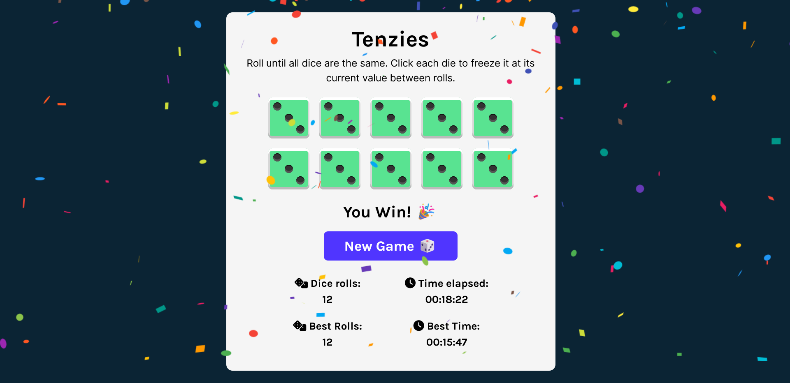

# Tenzies Game

Roll until all dice are the same.

Play the game here: https://helenclx.github.io/Tenzies-Game/

## Build Information

Built with Vite + React.

Based on the Tenzies game tutorial from Scrimba's [Learn React course](https://scrimba.com/learn/learnreact). However, I have made enhancements to the code to improve the app, including:

- Putting real dots on the dice using CSS
- Using relative units in CSS
- Making the app responsive to different screen sizes
- Adding dice roll count
- Recording the number of dice rolls and the time it took to win
- Tracking the best records of dice rolls and time taken to win

## Credits:

- Scrimba's [Learn React course](https://scrimba.com/learn/learnreact) - tutorial to create this game
- [Flaticon](https://www.flaticon.com/) -  for the dice vector image that is used as the page's favicon
- [Creating dice using CSS grid 🎲 ](https://dev.to/ekeijl/creating-dice-using-css-grid-j4) by Edwin ([@ekeijl](https://dev.to/ekeijl) on DEV Community)
- [Create a custom React stopwatch timer component](https://w3collective.com/react-stopwatch/) by w3collective - The time tracker feature of the game is based on this tutorial