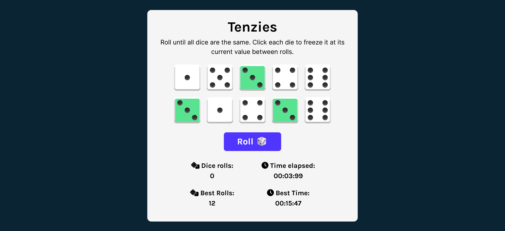

# Tenzies Game

Roll until all dice are the same.

Built with Vite + React.

## Credits:
- Scrimba's [Learn React course](https://scrimba.com/learn/learnreact) - tutorial to create this game
- [Flaticon](https://www.flaticon.com/) -  for the dice vector image that is used as the page's favicon
- [Creating dice using CSS grid 🎲 ](https://dev.to/ekeijl/creating-dice-using-css-grid-j4) by Edwin ([@ekeijl](https://dev.to/ekeijl) on DEV Community)